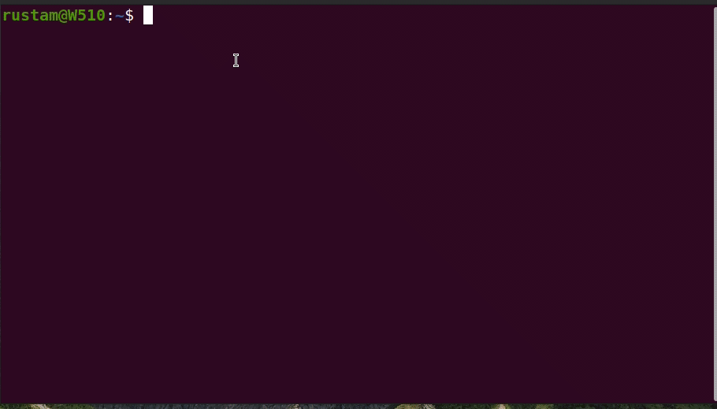

# hr
Draws a horizontal line in a console occupying the full width of a terminal. Inspired by &lt;hr&gt; HTML tag.

If may be useful for you if you want to split large output in a console visually somehow.

## Installation

1. Download *hr* binary from the [releases](https://github.com/rustamkulenov/hr/releases) page;
3. Make it executable;
4. Put it into some folder on a PATH (e.g. ~/bin or /opt);

```bash
wget https://github.com/rustamkulenov/hr/releases/download/%2Bv1.1/hr
chmod +x hr
cp ./hr /usr/local/bin/
echo It Works! | hr
```

## Usage

```bash
hr
hr <color>
```

A *color* parameter is optional and may be from this list: black, red, green, yellow, blue, magenta, cyan, white.

It is possible to provide a text to print on a center of the line into stdin:
```bash
echo CUT HERE | hr red
```



## Development & Testing

Written in Rust. Tested on Ubuntu 20.04 LTS.
